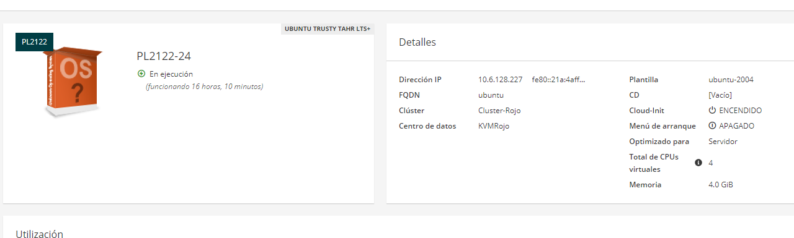
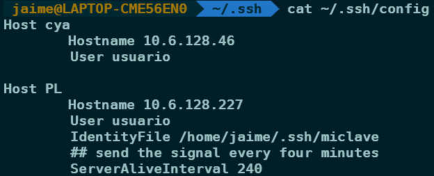
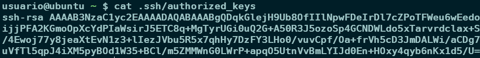
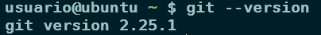
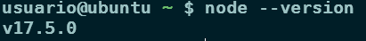
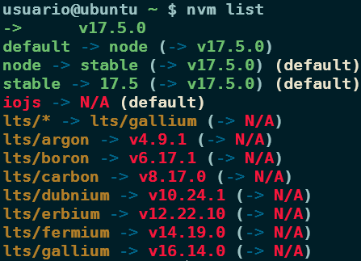
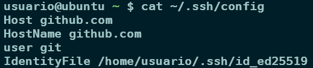
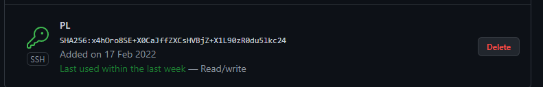
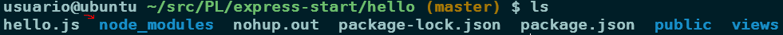
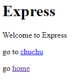

# iaas-jaime-armas-template

## Explicaciones de la tarea

### Comprobamos que la máquina virtual esta encendida correctamente



### Generamos una clave rsa en nuestra máquina local

```bash
ssh-keygen -trsa
```

### Añadimos una entrada al fichero `~/.ssh/config`



### Publicamos la clave dentro del archivo `.pub` que hayamos crado antes en la máquina del iaas



### Comprobamos que git esta instalado



### Tambien comprobamos tener instalado node.js



- En este caso, tenemos instalado node.js a través del gestor de versiones `nvm`

  

### Ahora configurarmos la máquina virtual para poder trabajar con GitHub sin problemas

1. Creamos la nueva clave para conectarnos a github

```bash
ssh-keygen -t ed25519 -C "your_email@example.com"
```

2. Actualizamos `~/.ssh/config` con esta nueva clave

   

3. Añadimos la clave a GitHub en los ajustes de `SSH keys`

   

### Ahora de desplejaremos una aplicación web en la máquina del iaas

1. En este caso, para hacerlo mas facil clonaremos un repositorio que nos permitira probar rapidamente si podemos desplejar

```bash
git clone git@github.com:crguezl/express-start.git
```

2. Modificaremos el archivo hello/hello.js para cambiar el puerto a usar a el 80, que es uno de los que nos permite nuestra maquina

```javascript
var express = require("express");
var app = express();
var path = require("path");

// view engine setup
app.set("views", path.join(__dirname, "views"));
app.set("view engine", "ejs");

app.use(express.static("public"));

app.get("/", function (req, res) {
  //res.send('Hello World!')
  res.render("index", { title: "Express" });
});

/*
 var router = express.Router();
  module.exports = router;
*/
app.get("/chuchu", function (req, res) {
  //res.send('Hello Chuchu!')
  res.render("index", { title: "Chuchu" });
});

app.get("/cat", function (req, res) {
  res.send("Got a GET request" + '<br/>');
});

app.get("/dog", function (req, res) {
  res.sendFile(path.join(__dirname, "public/dog.jpg"));
});

var server = app.listen(8080, function () {
  var host = server.address().address;
  var port = server.address().port;

  console.log("Example app listening at http://%s:%s", host, port);
});
```

3. Instalamos las dependencias que requiera nuestro proyecto a través del comando `npm install`, lo que nos creara una nueva carpeta llamada `node_modules`

   

4. Ahora, para iniciar la aplicación tendremos que usar el comando `node` para ejecutar el archivo `hello.js`,
   pero como queremos permitirle usar el puerto 80, habra que darle permiso con sudo y usar la version extendida de node

```bash
sudo /home/usuario/.nvm/versions/node/v17.5.0/bin/node hello.js
```

5. Si se quiere que la aplicación se mantenga activa incluso después de cerrar la sesión, entonces deberemos usar el siguiente comando

```bash
nohup sudo -b node hello.js
```

6. Finalmente, si todo va bien deberiamos poder ver la página cargada a través de `http://"ip maquina":80`

   
